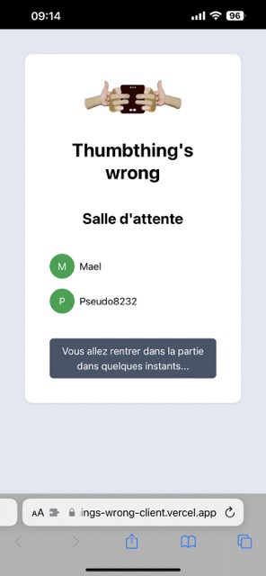
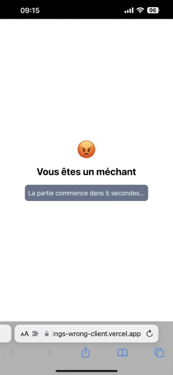
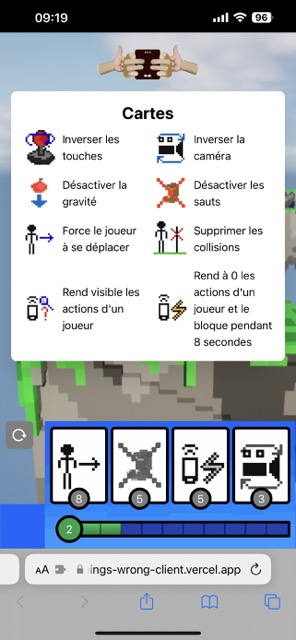
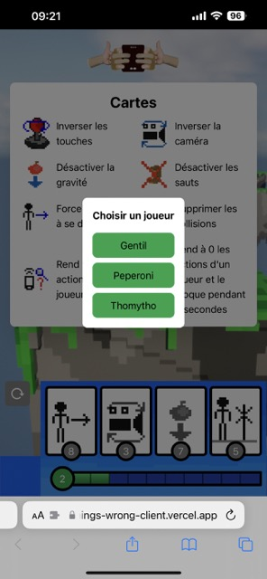
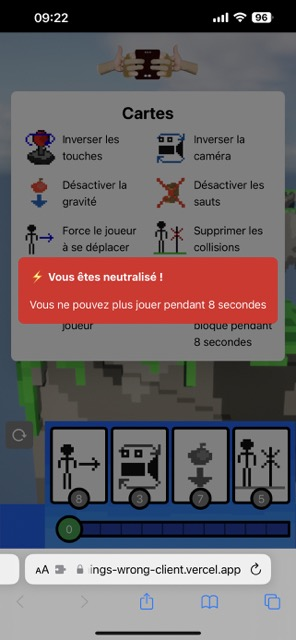

<h1 align="center">Thumthing's wrong</h1>
<h4 align="center">Web application companion</h4>

   
   
   

---

My team and I won the ESIR Game Jam 2023 with our game "Thumbthing's Wrong". It's a multiplayer game made with Unreal
Engine. A player is on PC and has to jump from platform to platform and up to 4 players on a mobile web app who have to
help (or not) the main player to advance using cards that break the rules of the game.

## Screenshots

